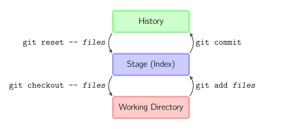

Git talk
    AMA!

Safe

    - That's what git is about
    - It's flexible, as a rope

(D)VCS

    - Centralized or Distributed
    - CVS and Subversion are VCSs while GIT and Mercurial are DVCSs.
    - Lock server on every operation vs work offline

Commit & HEAD

    - Commit is the atomic particle of GIT.
    - In git is like a snapshot of the files, not differences to previous
      versions.
    - May have a parent, or several, or none.
    - HEAD is the name of the commit we are now.

Branch & Master

    - Branch is only a pointer to a commit.
    - Master is the default name for the first branch in a repo.

Repository == History

    - Repository is the name for all the commits.
    - You'll find a .git dir inside it.
    - Once you commit, it's stored and can be shared with
      other people.

Remotes

    - Far away repos.
    - Intended for sharing work, or backups.
    - You can have several

Working Tree

    - The dir where you have .git folder
    - It contains the work your are working on
    - Some files might be unsaved, staged, not tracked...

Index == Staging Area

    - The index for the next commit
    - Not yet written to stone, it's a WIP

Beware: {

    - Common mistakes one can commit when getting started
    

Untracked files

    - Filetypes or paths can be set to be ignored always
    - We should check we added the files we want to commit
    

Modified afterwards

    - Even if we added a file to the index, it could have been modified
      afterwards
    - We will see it in both places: added and unstaged

}
   - Warning ends here

Stashes

    - Drawers to save your current work.
    - Noncomplicated, you just apply them over your current status

Hashes

    - You're going to see them everywhere, so let's talk about it.
    - Git checks everything by generating a 40-char checksum of the things.
    - You cannot modify something without git noticing.
    - If we want to refer to a commit or something that has no name, we can use
      its hash to do it.

Configuration

    - Several levels of config, global is for your user.
    - System is for every user on your machine, also repo level.

git config
<pre>
$ git config --global user.name "Fede Mon"
$ git config --global user.email gnu.fede@gmail.com
</pre>

    - Just to get started
    - Much more options

Create

    - Let's see how to convert a dir into a repo

git init
<pre>
$ git init
</pre>

    - Creates an 'empty' .git directory

Clone

    - That's how we copy previous work

git clone
<pre>
$ git clone http://github.com/gnufede/git-talk
</pre>
    - Grabs a .git directory from the internet, recreates HEAD in Working Tree

Download/Upload
<pre>
$ git pull
$ git push
</pre>
    - Save your work and share it with your team

Cheatsheet

    - Note the 3 stages

Do your stuff
    - Edit your files if you haven't

Stage
    - Add a file to the staging area

git add
<pre>
$ git add myfile.txt
$ git add stuff/
</pre>
    - . or dir allows to add everything there, including untracked files

Write
    - Create an actual commit that will go to the history
    

git commit
<pre>
$ git commit -m "bla"
$ git commit -am "bla"
</pre>
    - -a does everything in one command

Show
    - Check the status of your repo
    - Check the log of last commits
    - Check the diffs
    - See last modifications

git status
<pre>
$ git status
</pre>
    - Shows the status of your repo
    - Changes to commit
    - Changes not being commited

git log
<pre>
$ git log
</pre>
    - Shows the log of commits

git show
<pre>
$ git show 98765
$ git show 98765:path/file.txt
</pre>
    - Shows a commit

git diff
<pre>
$ git diff
$ git diff HEAD HEAD^2
</pre>
    - Shows the differences between commits/WD

git blame
<pre>
$ git blame
</pre>
    - Shows the files annotated with author and date

Open branches
<pre>
$ git checkout -b new_branch
</pre>
    - Use them to split work

Close branches
    - Joins two or more branches

git merge
<pre>
$ git merge master
$ git merge --no-ff master
</pre>

    - Use them to close tasks

Move around
    - We need to move around to do some changes

git checkout
<pre>
$ git checkout new_branch
$ git checkout -- file 
$ git checkout HEAD~2 file 
</pre>
    - Move to branch (-b creates branch)
    - Bring files from index or commit
    - -- Means no more options, to specify file paths

Undo/Reset 
    - I.E. If we miss some files in a commit

git reset
<pre>
$ git reset --soft HEAD^^ 
$ git reset --hard master
$ git reset master -- file
</pre>
    - Moves HEAD pointer (soft) (moving the branch)
    - Hard moves pointer, resets the index, and rebuilds WD
    - Mixed resets index, but keeps WD
    - With files, skips step 1 (doesn't move HEAD)

Diagram

    - See how commits reference their father

Here be dragons
    - Here starts the second part of the talk
    - This will be harder to follow

Revert
<pre>
$ git revert HEAD
</pre>
    - Creates an inverse commit
    - Useful to undo things at any point.
    - No mess at all.

Rebase
    - You can change a branch parent.
    - It changes the whole branch: commits get different refs.
    - Commits are 'copied'
    - Interactive allows us to edit, squash, change order of commits

Cherry-pick
    - Allows to pick a single commit and copy it in a different branch.
    - Like a small version of rebase

Merge or Rebase
    - Both merge and rebase work to integrate changes.
    - They are not similar.
    - Rebase should be used when we use temporal branches.

Merging features
<pre>
@feature$ git merge master
@master$ git merge --no-ff feature
</pre>
    - From feature incorporate master's changes to be compatible
    - Merge --no-ff should be used to create meaningful merges at master

Possible flow
<pre>
$ git pull --rebase
$ git rebase -i @{u}
$ git push
</pre>
    - Avoid merge commits at pull (not meaningful)
    - Cleanup local commits before push with rebase -i

Reflog
<pre>
$ git reflog
</pre>
    - Log of where our HEAD was last months.
    - You can find there refs to commits you wouldn't (rebased branches)

Find the lost commit
<pre>
$ git log --reflog --graph \ 
--date-order --decorate=short
</pre>
    - There we see unreachable commits and where they come from
    - Ordered by date is maybe easier than default (topo)

Find the bad one
<pre>
$ git bisect start #bad #good
$ git bisect run test-error.sh
$ git bisect reset
</pre>
    - Binary searches first bad commit
    - Test-error should return 0 if everything's OK
    - Test-error shoud return 125 if cannot be tested (will skip)
    - Test-error exit code 1-127 for bad

Conflicts
    - Conflict resolution is the hardest part at work.

3-way resolution
<pre>
$ git config merge.conflictStyle diff3
</pre>
    - We can change conflict style from merge to diff3.
    - With --global if you want it in every repo.

3-way output
<pre>
<<<<<<< HEAD
master change.
||||||| merged
Original.
=======
b1 change.
>>>>>>> b1
</pre>
    - Sample 3-way output

Ours or Theirs
<pre>
$ git checkout --ours file.txt
$ git checkout --theirs file.txt
</pre>
    - We can solve conflicts saying: take my file.

Strategies
<pre>
@master$ git merge -s recursive -X theirs dev
@master$ git merge -s recursive -X patience dev
@master$ git merge -s resolve dev
</pre>
    - There are severa strategies with multiple options
    - For 3-way-merges default is recursive. It's the most complete one.
    - It goes recursively finding common ancestors in the branches.
    - -X theirs would take dev's lines in conflicts
    - If a somewhat simple merge fails, you could try another strategy, like
      resolve.

ReReRe
<pre>
$ git config rerere.enabled true
$ git rerere
</pre>
    - Enable Reuse Recorded Resolution
    - Each time you resolve a conflict, it will save the diff
    - With rerere you replay the resolution.
    - This way, if you constantly rebase or merge to keep up to date, you won't
      have to resolve manually each time

Use your tool

<pre>
$ git difftool
$ git mergetool
</pre>
    - Git provides a way to choose your tool.

Special files
<pre>
*.pbxproj binary merge=union
</pre>
    - Git attributes
    - Per-file or extension merge drivers
    - Options are: text, binary or union
    - Union means include files from both without markers

Patches
<pre>
$ git format-patch master --stdout > my.patch
$ git apply *.patch
</pre>
    - You can use git to generate patches of code
    - Or apply someone's patch
    - Way to create and to apply patch

Useful patching
<pre>
$ git add --patch
$ git checkout -p
$ git reset -p
</pre>

This is not all
    - There are more commands and options than you can imagine

Thanks
    - See you next time
